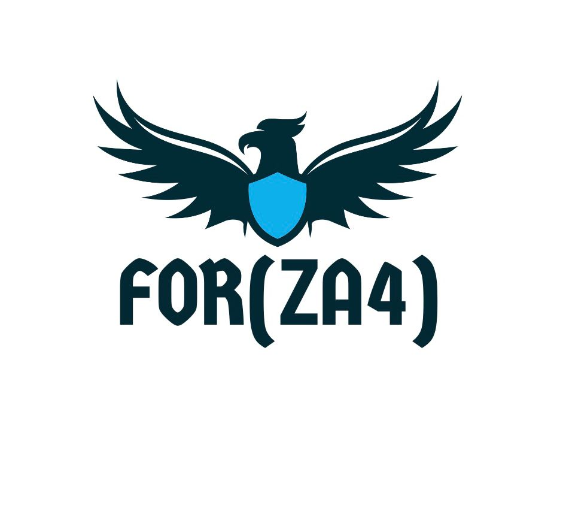
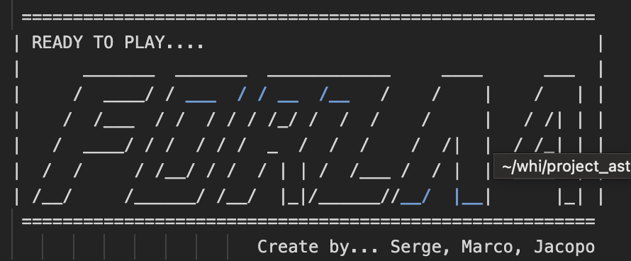

# PROGETTO FORZA 4
# 
# VI DIAMO IL BENVENUTO NELLA NOSTRA PAGINA DI PRESENTAZIONE DEL PROGETTO FORZA 4

# INTRODUZIONE AL PROGETTO

Questo progetto viene realizzato per il corso di ingegneria del software della società ASTROIT.
Il progetto consiste nella creazione del gioco "Forza 4", nel quale sarà possibile giocare in locale.
Il programma viene creato in C++ utilizzando:

# Librerie adoperate durante il corso:

                                        - <iostream>
                                        - <random>

  #  READY TO PLAY....   

  
                                                          
                               

 #  OBIETTIVO DEL GIOCO

L'obiettivo del giocatore è quello di mettere in fila quattro gettoni (X,O). La scacchiera rettangolare è posta in orizzontale. 
Il giocatore vince quando mette in fila quattro gettoni in verticale o in diagonale o in orizzontale.

# VITTORIA IN DIAGONALE(X)

Quando un giocatore mette in fila quattro gettone in diagonale, il programma stampa a video che il giocatore che ha vinto.

# VITTORIA IN ORIZZONTALE(X)

Quando un giocatore mette in fila quattro gettoni in orizzontale, il programma stampa a video che il giocatore che ha vinto.
 

# VITTORIA IN VERTICALE(X)

E alla fine quando un giocatore mette in fila quattro gettoni in verticale, il programma stampa a video che il giocatore che ha vinto.

# COME GIOCARE AL FORZA 4

Per giocare bisogna scaricare il file "forza4.exe" e lanciarlo.
Il gioco è in italiano e si gioca in locale.
Per giocare in locale bisogna inserire il nome del giocatore e premere "INVIO".

                                     Grazie per aver scaricato questo progetto.
                                             Buon divertimento a presto.
                 
