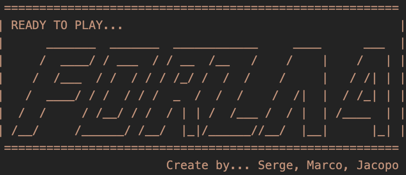

# PROGETTO FORZA 4
# 
# VI DIAMO IL BENVENUTO NELLA NOSTRA PAGINA DI PRESENTAZIONE DEL PROGETTO FORZA 4

# INTRODUZIONE AL PROGETTO

Questo progetto viene realizzato per il corso di ingegneria del software della società ASTROIT.
Il progetto consiste nella creazione del gioco "Forza 4", nel quale sarà possibile giocare in locale o in rete.
Il programma viene creato in C++ utilizzando:

# Librerie adoperate durante il corso:

                                        - <iostream>
                                        - <string>
                                        - <array>
                                        - <random>
                                        - <vector>

  #  READY TO PLAY....   

  
                                                          
                               

 #  OBIETTIVO DEL GIOCO

L'obiettivo di ogni giocatore (G1,G2) è quello di mettere in fila quattro pedine proprie (X,O). La scacchiera rettangolare è posta in orizzontale. 
Il gioco termina automaticamente (il programma effetua il controllo) quando uno dei giocatori ha messo in fila quattro delle sue pedine in verticale o in diagonale o in orizzontale.

# VITTORIA IN DIAGONALE(X)

Quando un giocatore mette in fila quattro pedine proprie in diagonale, il programma stampa a video il nome del giocatore che ha vinto e il programma termina.

# VITTORIA IN ORIZZONTALE(X)

Quando un giocatore mette in fila quattro pedine proprie in orizzontale, il programma stampa a video il nome del giocatore che ha vinto e il programma termina.
 

# VITTORIA IN VERTICALE(X)

E alla fine quando un giocatore mette in fila quattro pedine proprie in verticale, il programma stampa a video il nome del giocatore che ha vinto e il programma termina.

# COME GIOCARE AL FORZA 4

Per giocare bisogna scaricare il file "forza4.exe" e lanciarlo.
Il gioco è in italiano e si gioca in locale o in rete.
Per giocare in locale bisogna inserire il nome dei due giocatori e premere "OK".
Per giocare in rete bisogna inserire il nome del giocatore e premere "OK".
In seguito bisogna inserire l'indirizzo IP del giocatore con cui si vuole giocare e premere "OK".
Il giocatore che ha inserito l'indirizzo IP deve premere "OK" per avviare la partita.

                                     Grazie per aver scaricato questo progetto.
                                             Buon divertimento a presto.
                 

              
                               
